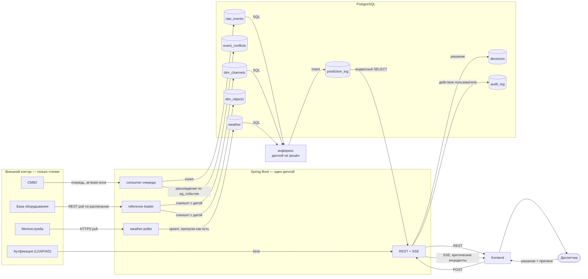

Frontend => Backend => ML (obvius)
Должно быть понимание по чему передаются данные. 

Все ограничения строгие на метрики вторичны, главное - понять саму архитектуру.

---

# Архитектура: сервисы и потоки данных

Рендер решений из [DECISIONS.md](DECISIONS.md). Продовый рантайм — как система работает в эксплуатации; обучение моделей и эксперименты вне скоупа (ADR-001). Нарезка по источникам (ADR-009). Акцент на транспортах — по чему именно идут данные между узлами.

## Карта

## Компоненты внутри Spring Boot

Отдельных сервисов приёма не выделяем, всё живёт в существующем приложении (ADR-006).

- **consumer очереди** — подписка на брокер Заказчика, мы только читаем (ADR-005). Дедуп по `ид_события`: совпало — no-op, разошлось — пишем обе версии в `event_conflicts`, текущее значение не меняем (ADR-012).
- **reference-loader** — REST pull реестров по расписанию (ADR-013), каждый pull кладётся отдельным снапшотом с датой (ADR-015).
- **weather-poller** — HTTPS pull текущей погоды и прогноза, архив не храним (ADR-017). Пропуски не маскируем (ADR-019).
- **REST + SSE** — выдача данных и пуш уведомлений (ADR-020), аутентификация через LDAP/AD, аудит действий отдельным логом (ADR-023).
- **CSV-ридер** — один полноценный на все файловые входы, без быстрого split (ADR-016).

## Таблицы

Объём несёт одна таблица, остальные — справочники и журналы.

| Таблица | Порядок размера |
|---|---|
| `raw_events` — сырой поток, партиции по дате | ~319 млн строк |
| `prediction_log`, `decisions`, `audit_log` | растут с эксплуатацией |
| `dim_channels`, `dim_objects` | 11.5 тыс. и 95 × число снапшотов |
| `weather`, `district_geo`, `reason_codes`, `event_conflicts` | десятки–тысячи строк |

## Поток 1 — измерения СМВУ

1. Брокер Заказчика → `consumer` очереди. Доставка at-least-once, значит дубли приходят штатно.
2. Разбор строки: шесть полей, `дата` и `время` склеиваются в timestamp, `значение_датчика` сохраняется как text, а рядом в тех же колонках `raw_events` пишется типизированная проекция по типу датчика — `num_value`, `text_value`, `ts_value` (ADR-007).
3. Вставка в `raw_events`. Канал, которого нет в актуальном снапшоте реестра, не блокирует приём — событие принимается, канал помечается неизвестным (ADR-014).
4. Расхождение по существующему `ид_события` → обе версии в `event_conflicts`, счётчик, текущее значение не трогаем.

## Поток 2 — журналы ОДС

Отдельного приёмника нет: в выданных данных срабатывания живут в том же журнале под флагом `тревожное`, а тип инцидента закодирован значением датчика. Существует ли настоящий журнал ОДС отдельно — **вопрос в Q&A** (ADR-010).

## Поток 3 — реестры

1. Учётные системы Заказчика → `reference-loader` по REST, по расписанию (ADR-013).
2. Каждая загрузка — отдельный снапшот с датой в `dim_channels` и `dim_objects` (ADR-015).
3. Событие связывается с той версией реестра, что была актуальна на его дату. Для событий старше первой нашей загрузки метаданных не будет.

## Поток 4 — метеоданные

1. Открытое API метеослужбы → `weather-poller` по HTTPS, только текущее состояние и прогноз на 1-2 дня(ADR-017).
2. Upsert в `weather`. Привязка к объектам — по районам из иерархии, сопоставление район→точка задаётся вручную (ADR-018).
3. Источник недоступен — дырки остаются дырками, инференс не останавливается, ML разбирается с пропусками сам (ADR-019).

## Поток 5 — решения диспетчера (от пользователя в систему)

1. Инференс пишет прогноз в `prediction_log`; `api` читает журнал индексным запросом и отдаёт в `frontend` по REST, критические инциденты уходят по SSE (ADR-020).
2. Диспетчер разбирает и фиксирует решение, выбирая причину из статичного справочника плюс свободный комментарий (ADR-022).
3. `frontend` отправляет `POST`, решение пишется в `decisions` и привязывается к прогнозу **либо** к срабатыванию — непредсказанные события тоже получают разметку (ADR-021).
4. В журнале это читается на уровне объекта и интервала времени, с детализацией до конкретного прогноза или срабатывания.
5. Действия пользователя параллельно уходят в `audit_log` (ADR-023).
6. Прямых вызовов инференса из интерфейса нет — `frontend` и ML развязаны через `prediction_log`.

## Что ещё не решено

- **Хранилище и аналитический контур** (ADR-008) — открыт вопрос отдельного хранилища для аналитиков; репликация зафиксирована как точка расширения.
- **Батч-импорт истории** (ADR-011) — постоянный вход или разовая загрузка, вопрос в Q&A.
- **Деплой инференса** — как отдельный процесс или внутри приложения; в HACK-15 не решалось.