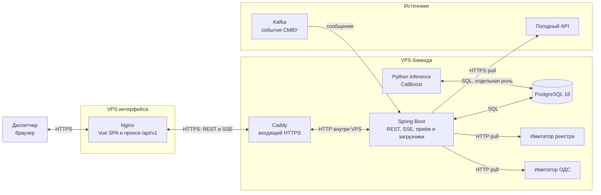
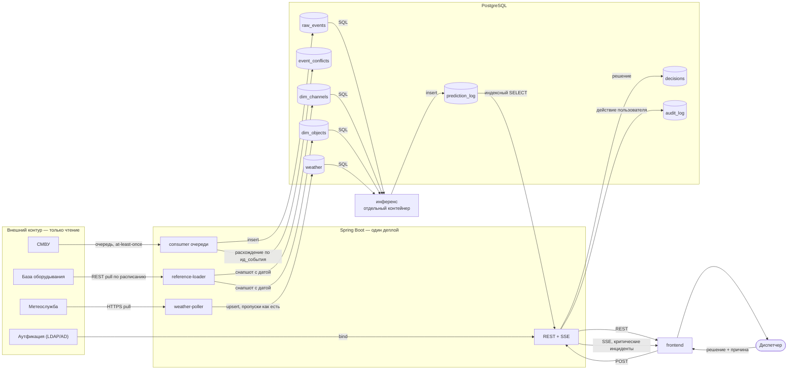
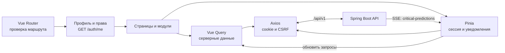
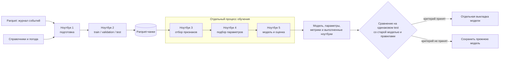

# Архитектура решения «Москоллектор»

Документ описывает реализованный рабочий контур, поток данных и отдельный
контур обучения. Схемы построены по конфигурации развёртывания и коду
репозиториев `backend`, `frontend` и `ml`. История проектных решений хранится
в [DECISIONS.md](DECISIONS.md); описание форматов — в
[CONTRACTS.md](CONTRACTS.md).

## 1. Развёртывание рабочего контура

```mermaid
flowchart LR
  user["Диспетчер<br/>браузер"]

  subgraph front["VPS интерфейса"]
    nginx["Nginx<br/>Vue SPA и прокси /api/v1"]
  end

  subgraph back["VPS бэкенда"]
    caddy["Caddy<br/>входящий HTTPS"]
    api["Spring Boot<br/>REST, SSE, приём и загрузчики"]
    db[("PostgreSQL 18")]
    inference["Python inference<br/>CatBoost"]
    registry["Имитатор реестра"]
    ods["Имитатор ОДС"]
  end

  subgraph sources["Источники"]
    kafka["Kafka<br/>события СМВУ"]
    weather["Погодный API"]
  end

  user <-->|"HTTPS"| nginx
  nginx <-->|"HTTPS: REST и SSE"| caddy
  caddy <-->|"HTTP внутри VPS"| api
  kafka -->|"сообщения"| api
  api -->|"HTTP pull"| registry
  api -->|"HTTP pull"| ods
  api -->|"HTTPS pull"| weather
  api <-->|"SQL"| db
  inference <-->|"SQL, отдельная роль"| db
```

Фронтенд и бэкенд на стенде размещены на разных VPS. Браузер обращается к
фронтовому Nginx; запросы `/api/v1` и поток SSE проходят через него к Caddy
на VPS бэкенда. Java-приложение и Python-инференс не вызывают друг друга по
HTTP: их стык — таблицы PostgreSQL. На стенде реестр, ОДС и поток СМВУ
представлены имитаторами; это не подключение к действующим системам
Заказчика. Источник погоды подключается отдельно.

Аутентификация и права проверяются в бэкенде. Стенд использует локальные
учётные записи; конфигурация бэкенда также предусматривает LDAP/AD. Интерфейс
получает cookie-сессию и передаёт CSRF-токен для изменяющих запросов.

## 2. Данные, прогноз и решение диспетчера

```mermaid
graph LR
  subgraph EXT["Внешний контур — только чтение"]
    SMVU["СМВУ"]
    ACC["База оборудывания"]
    MET["Метеослужба"]
    LDAP["Аутфикация (LDAP/AD)"]
  end

  subgraph APP["Spring Boot — один деплой"]
    CONS["consumer очереди"]
    REFL["reference-loader"]
    WTH["weather-poller"]
    API["REST + SSE"]
  end

  subgraph PG["PostgreSQL"]
    RAW[("raw_events")]
    CONF[("event_conflicts")]
    DIMC[("dim_channels")]
    DIMO[("dim_objects")]
    WX[("weather")]
    PRED[("prediction_log")]
    DEC[("decisions")]
    AUD[("audit_log")]
  end

  INF["инференс<br/>отдельный контейнер"]
  UI["frontend"]
  DISP(["Диспетчер"])

  SMVU -->|"очередь, at-least-once"| CONS
  CONS -->|"insert"| RAW
  CONS -->|"расхождение по ид_события"| CONF
  ACC -->|"REST pull по расписанию"| REFL
  REFL -->|"снапшот с датой"| DIMC
  REFL -->|"снапшот с датой"| DIMO
  MET -->|"HTTPS pull"| WTH
  WTH -->|"upsert, пропуски как есть"| WX

  RAW -->|"SQL"| INF
  DIMC -->|"SQL"| INF
  DIMO -->|"SQL"| INF
  WX -->|"SQL"| INF
  INF -->|"insert"| PRED

  PRED -->|"индексный SELECT"| API
  API -->|"REST"| UI
  API -->|"SSE, критические инциденты"| UI
  UI --> DISP
  DISP -->|"решение + причина"| UI
  UI -->|"POST"| API
  API -->|"решение"| DEC
  API -->|"действие пользователя"| AUD
  LDAP -->|"bind"| API
```

**Компоненты.** Всё, кроме инференса, живёт в одном Spring Boot (ADR-006):

- **consumer очереди** читает брокер Заказчика; дубль по `ид_события` — no-op, расхождение — обе версии в `event_conflicts` (ADR-005, ADR-012);
- **reference-loader** по расписанию тянет реестры по REST и кладёт снапшот с датой (ADR-013, ADR-015);
- **weather-poller** берёт текущую погоду и прогноз на 3 дня, пропуски не маскирует (ADR-017, ADR-019);
- **REST + SSE** отдают данные и критические прогнозы, вход через LDAP/AD, действия пишутся в `audit_log` (ADR-020, ADR-023).

**Инференс** — отдельный контейнер из репо `ml` под ролью `inference` (ADR-025). Читает события, погоду и реестры, пишет в `prediction_log` риск по каналу с `shap` (тип пока один — `CHANNEL_EVENT`) и сам удаляет свои просроченные строки. Выкатывается по push в `main` репо `ml`.

**Потоки:**

1. **СМВУ** — доставка at-least-once; значение хранится текстом плюс типизированная проекция (ADR-007), неизвестный канал приём не блокирует (ADR-014).
2. **ОДС** — отдельного журнала в данных нет, срабатывания идут флагом `тревожное` в том же журнале (ADR-010).
3. **Реестры** — событие связывается со снапшотом, актуальным на его дату.
4. **Погода** — берется по одному району, данные о районе не предоставлены.

**Моки систем заказчика**
При отсутсвии систем заказчика созданы моки сервисов
5. **Решения** — диспетчер выбирает причину из справочника и пишет комментарий (ADR-022); решение привязано к прогнозу или срабатыванию (ADR-021). Интерфейс модель не вызывает, стык — `prediction_log`.
6. **Импорт истории** — CSV/XLSX → `POST /api/v1/admin/import/journal` → `import_jobs`, ответ 202; загрузка пачками, расхождение по `ид_события` её останавливает (ADR-011, ADR-012).

**Объёмы:** `raw_events` — ~319 млн строк с партициями по дате; `dim_channels` — 11.5 тыс., `dim_objects` — 95 на снапшот; журналы прогнозов, решений и аудита растут с эксплуатацией.

## 3. Внутренняя схема интерфейса

```mermaid
flowchart LR
  router["Vue Router<br/>проверка маршрута"] --> auth["Профиль и права<br/>GET /auth/me"]
  auth --> pages["Страницы и модули"]
  pages --> query["Vue Query<br/>серверные данные"]
  pages --> store["Pinia<br/>сессия и уведомления"]
  query --> http["Axios<br/>cookie и CSRF"]
  store --> http
  http <-->|"/api/v1"| backend["Spring Boot API"]
  backend -->|"SSE: critical-predictions"| store
  store -->|"обновить запросы"| query
```

При запуске для разработки MSW может подменять ответы `/api/v1`; в сборке
рабочего стенда он выключен. Права на маршруты в Vue управляют навигацией;
бэкенд повторно проверяет права и область видимости данных при каждом
запросе.

## 4. Обучение и выпуск модели

```mermaid
flowchart LR
  journal["Parquet: журнал событий"] --> prep["Ноутбук 1<br/>подготовка"]
  reference["Справочники и погода"] --> prep
  prep --> split["Ноутбук 2<br/>train / validation / test"]
  split --> chunks[("Parquet-чанки")]

  subgraph train["Отдельный процесс обучения"]
    select["Ноутбук 3<br/>отбор признаков"]
    tune["Ноутбук 4<br/>подбор параметров"]
    final["Ноутбук 5<br/>модель и оценка"]
  end

  chunks --> select --> tune --> final
  final --> artifacts["Модель, параметры,<br/>метрики и выполненные ноутбуки"]
  artifacts --> compare{"Сравнение на одинаковом test<br/>со старой моделью и правилами"}
  compare -->|"критерий принят"| deploy["Отдельная выкладка модели"]
  compare -->|"критерий не принят"| retain["Сохранить прежнюю модель"]
```

`ml/retraining/run_pipeline.py` выполняет пять ноутбуков последовательно и
складывает результаты в каталог отдельного запуска. Экспериментальный
облачный прогон может передавать подготовленные после этапов 1–2 чанки через
Yandex Object Storage на ВМ с большим объёмом памяти и выполнять этапы 3–5
там. Этот путь не запускается из веб-интерфейса и не заменяет рабочую модель
автоматически.

В `main` репозитория `ml` этапы отбора и подбора ограничивают число
train/validation-чанков. Итоговый test читается полностью, однако test также
используется при отборе признаков. Поэтому число фактически использованных
чанков и метод оценки нужно проверять по артефактам каждого запуска.
Сравнение со старой моделью и простыми правилами «тревога вчера» и «не менее
10 тревог вчера» на одной выборке — отдельная проверка перед выкладкой.

## 5. Локальный демонстрационный пакет

[Единый ZIP](demo/README.md) содержит исходники трёх сервисов и один
`compose.yaml`. Он собирает фронтенд, бэкенд и инференс, поднимает PostgreSQL,
Kafka и имитаторы на одном Docker-хосте. Это другая схема размещения, чем
два VPS рабочего стенда; логический поток данных остаётся тем же. В архиве
нет полной исторической выгрузки, а обучение модели не запускается.

## Исходные документы

- [Бэкенд: описание решения](https://github.com/hack-goal-team/backend/blob/main/docs/PROJECT-DOCUMENTATION.md), [схема БД](https://github.com/hack-goal-team/backend/blob/main/docs/SCHEMA.sql) и [конфигурация VPS](https://github.com/hack-goal-team/backend/blob/main/deploy/compose.prod.yaml).
- [Фронтенд: архитектура приложения](https://github.com/hack-goal-team/frontend/blob/main/docs/architecture.md).
- [ML: цикл инференса](https://github.com/hack-goal-team/ml/blob/main/inference/runner.py) и [пайплайн обучения](https://github.com/hack-goal-team/ml/blob/main/retraining/README.md).
