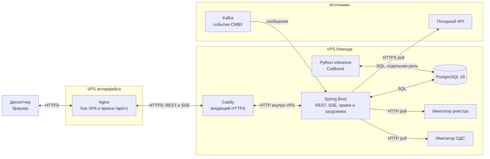
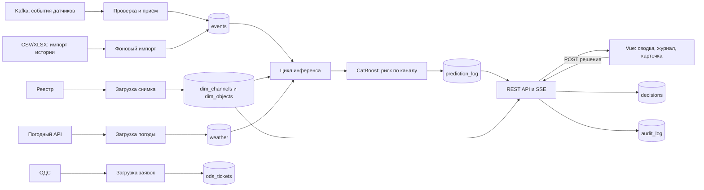
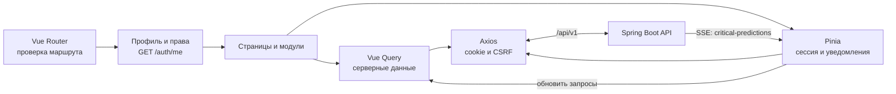
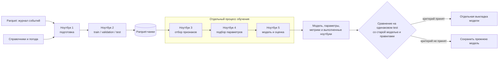

# Архитектура решения «Москоллектор»

Документ описывает реализованный рабочий контур, поток данных и отдельный
контур обучения. Схемы построены по конфигурации развёртывания и коду
репозиториев `backend`, `frontend` и `ml`. История проектных решений хранится
в [DECISIONS.md](DECISIONS.md); описание форматов — в
[CONTRACTS.md](CONTRACTS.md).

## 1. Развёртывание рабочего контура

```mermaid
flowchart LR
  user["Диспетчер<br/>браузер"]

  subgraph front["VPS интерфейса"]
    nginx["Nginx<br/>Vue SPA и прокси /api/v1"]
  end

  subgraph back["VPS бэкенда"]
    caddy["Caddy<br/>входящий HTTPS"]
    api["Spring Boot<br/>REST, SSE, приём и загрузчики"]
    db[("PostgreSQL 18")]
    inference["Python inference<br/>CatBoost"]
    registry["Имитатор реестра"]
    ods["Имитатор ОДС"]
  end

  subgraph sources["Источники"]
    kafka["Kafka<br/>события СМВУ"]
    weather["Погодный API"]
  end

  user <-->|"HTTPS"| nginx
  nginx <-->|"HTTPS: REST и SSE"| caddy
  caddy <-->|"HTTP внутри VPS"| api
  kafka -->|"сообщения"| api
  api -->|"HTTP pull"| registry
  api -->|"HTTP pull"| ods
  api -->|"HTTPS pull"| weather
  api <-->|"SQL"| db
  inference <-->|"SQL, отдельная роль"| db
```

Фронтенд и бэкенд на стенде размещены на разных VPS. Браузер обращается к
фронтовому Nginx; запросы `/api/v1` и поток SSE проходят через него к Caddy
на VPS бэкенда. Java-приложение и Python-инференс не вызывают друг друга по
HTTP: их стык — таблицы PostgreSQL. На стенде реестр, ОДС и поток СМВУ
представлены имитаторами; это не подключение к действующим системам
Заказчика. Источник погоды подключается отдельно.

Аутентификация и права проверяются в бэкенде. Стенд использует локальные
учётные записи; конфигурация бэкенда также предусматривает LDAP/AD. Интерфейс
получает cookie-сессию и передаёт CSRF-токен для изменяющих запросов.

## 2. Данные, прогноз и решение диспетчера

```mermaid
flowchart LR
  stream["Kafka: события датчиков"] --> consumer["Проверка и приём"]
  file["CSV/XLSX: импорт истории"] --> importer["Фоновый импорт"]
  consumer --> events[("events")]
  importer --> events

  registry["Реестр"] --> loader["Загрузка снимка"]
  loader --> dims[("dim_channels и dim_objects")]
  weather_api["Погодный API"] --> weather_pull["Загрузка погоды"]
  weather_pull --> weather[("weather")]
  ods["ОДС"] --> ods_pull["Загрузка заявок"]
  ods_pull --> tickets[("ods_tickets")]

  events --> runner["Цикл инференса"]
  dims --> runner
  weather --> runner
  runner --> model["CatBoost: риск по каналу"]
  model --> predictions[("prediction_log")]
  predictions --> api["REST API и SSE"]
  dims --> api
  api --> ui["Vue: сводка, журнал, карточка"]
  ui -->|"POST решения"| api
  api --> decisions[("decisions")]
  api --> audit[("audit_log")]
```

Потоковый приём и импорт истории пишут в `events`. Снимки справочников,
погода и заявки ОДС хранятся отдельно. Рабочий процесс `ml` запускается как
`python -m inference.runner`: читает новые события и необходимые справочники
из PostgreSQL, восстанавливает скользящие окна и пишет прогнозы в
`prediction_log`. Единица прогноза — канал; объект определяется через
актуальный справочник каналов. При первом запуске исторические события
используются для прогрева окон, а не для создания прогнозов задним числом.

API читает готовые прогнозы и отдаёт их интерфейсу. SSE сообщает об
обновлении критических прогнозов; это снимок текущего состояния, а не очередь
с гарантированной доставкой каждого события. Решение диспетчера сохраняется
отдельно от прогноза; действия пользователя фиксируются в аудите. В
реализованной форме интерфейса решение создаётся для прогноза. Прямого
вызова модели из браузера нет.

В репозитории `ml` есть также самостоятельное HTTP API в `app.py`.
Конфигурация рабочего стенда запускает именно `inference.runner`, поэтому
HTTP API `app.py` не является транспортом между Java и Python в этой схеме.

## 3. Внутренняя схема интерфейса

```mermaid
flowchart LR
  router["Vue Router<br/>проверка маршрута"] --> auth["Профиль и права<br/>GET /auth/me"]
  auth --> pages["Страницы и модули"]
  pages --> query["Vue Query<br/>серверные данные"]
  pages --> store["Pinia<br/>сессия и уведомления"]
  query --> http["Axios<br/>cookie и CSRF"]
  store --> http
  http <-->|"/api/v1"| backend["Spring Boot API"]
  backend -->|"SSE: critical-predictions"| store
  store -->|"обновить запросы"| query
```

При запуске для разработки MSW может подменять ответы `/api/v1`; в сборке
рабочего стенда он выключен. Права на маршруты в Vue управляют навигацией;
бэкенд повторно проверяет права и область видимости данных при каждом
запросе.

## 4. Обучение и выпуск модели

```mermaid
flowchart LR
  journal["Parquet: журнал событий"] --> prep["Ноутбук 1<br/>подготовка"]
  reference["Справочники и погода"] --> prep
  prep --> split["Ноутбук 2<br/>train / validation / test"]
  split --> chunks[("Parquet-чанки")]

  subgraph train["Отдельный процесс обучения"]
    select["Ноутбук 3<br/>отбор признаков"]
    tune["Ноутбук 4<br/>подбор параметров"]
    final["Ноутбук 5<br/>модель и оценка"]
  end

  chunks --> select --> tune --> final
  final --> artifacts["Модель, параметры,<br/>метрики и выполненные ноутбуки"]
  artifacts --> compare{"Сравнение на одинаковом test<br/>со старой моделью и правилами"}
  compare -->|"критерий принят"| deploy["Отдельная выкладка модели"]
  compare -->|"критерий не принят"| retain["Сохранить прежнюю модель"]
```

`ml/retraining/run_pipeline.py` выполняет пять ноутбуков последовательно и
складывает результаты в каталог отдельного запуска. Экспериментальный
облачный прогон может передавать подготовленные после этапов 1–2 чанки через
Yandex Object Storage на ВМ с большим объёмом памяти и выполнять этапы 3–5
там. Этот путь не запускается из веб-интерфейса и не заменяет рабочую модель
автоматически.

В `main` репозитория `ml` этапы отбора и подбора ограничивают число
train/validation-чанков. Итоговый test читается полностью, однако test также
используется при отборе признаков. Поэтому число фактически использованных
чанков и метод оценки нужно проверять по артефактам каждого запуска.
Сравнение со старой моделью и простыми правилами «тревога вчера» и «не менее
10 тревог вчера» на одной выборке — отдельная проверка перед выкладкой.

## 5. Локальный демонстрационный пакет

[Единый ZIP](demo/README.md) содержит исходники трёх сервисов и один
`compose.yaml`. Он собирает фронтенд, бэкенд и инференс, поднимает PostgreSQL,
Kafka и имитаторы на одном Docker-хосте. Это другая схема размещения, чем
два VPS рабочего стенда; логический поток данных остаётся тем же. В архиве
нет полной исторической выгрузки, а обучение модели не запускается.

## Исходные документы

- [Бэкенд: описание решения](https://github.com/hack-goal-team/backend/blob/main/docs/PROJECT-DOCUMENTATION.md), [схема БД](https://github.com/hack-goal-team/backend/blob/main/docs/SCHEMA.sql) и [конфигурация VPS](https://github.com/hack-goal-team/backend/blob/main/deploy/compose.prod.yaml).
- [Фронтенд: архитектура приложения](https://github.com/hack-goal-team/frontend/blob/main/docs/architecture.md).
- [ML: цикл инференса](https://github.com/hack-goal-team/ml/blob/main/inference/runner.py) и [пайплайн обучения](https://github.com/hack-goal-team/ml/blob/main/retraining/README.md).
