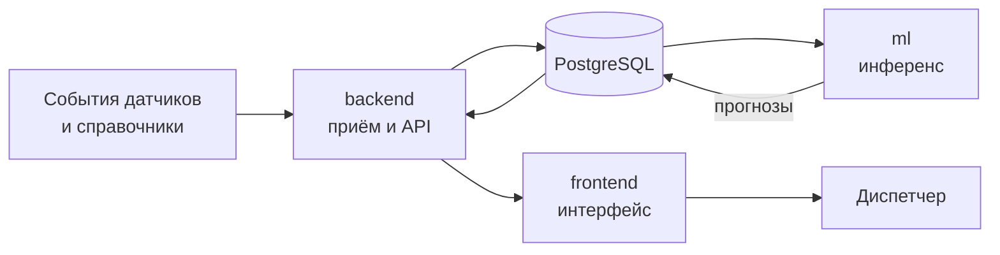

# hack-goal-team

Пилотная система предиктивной аналитики инженерной инфраструктуры для
диспетчерской службы «Москоллектор». Система принимает события каналов
датчиков, рассчитывает прогноз риска и показывает диспетчеру историю
прогнозов и принятых решений.

| Репозиторий | Назначение |
| --- | --- |
| [`backend`](https://github.com/hack-goal-team/backend) | Java API, приём данных, PostgreSQL, интеграции и права доступа |
| [`frontend`](https://github.com/hack-goal-team/frontend) | Интерфейс на Vue 3 |
| [`ml`](https://github.com/hack-goal-team/ml) | Python-инференс и пайплайн повторного обучения |

Доступ к исходному коду определяется правами на соответствующие репозитории.

## Документация

- [Архитектура и схемы потоков](https://github.com/hack-goal-team/.github/blob/main/ARCHITECTURE.md)
- [Исходные контракты и требования](https://github.com/hack-goal-team/.github/blob/main/CONTRACTS.md)
- [История архитектурных решений](https://github.com/hack-goal-team/.github/blob/main/DECISIONS.md)
- [Локальный запуск на Windows, macOS и Linux](https://github.com/hack-goal-team/.github/blob/main/demo/README.md)

Для рабочего стенда фронтенд и бэкенд развёрнуты на разных VPS. Локальный
демонстрационный пакет запускает их вместе с базой, Kafka и инференсом через
Docker Compose. Экспериментальное обучение выполняется отдельно и не меняет
рабочую модель автоматически.
